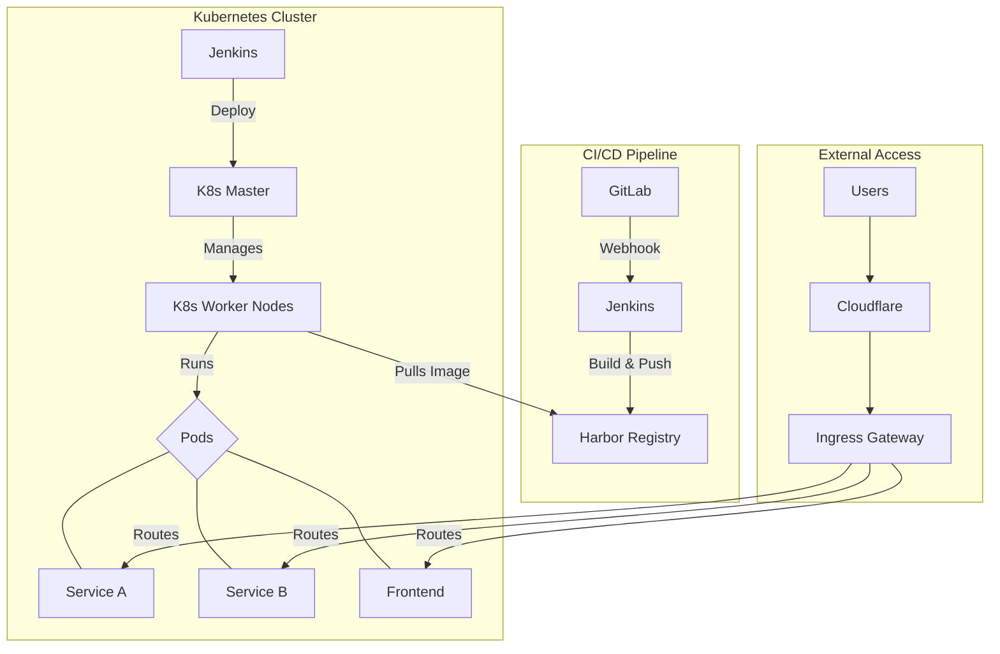

# 部署设计

## 1. 环境规划

| 环境 | 用途 | 访问控制 | 数据库 | 备注 |
|---|---|---|---|---|
| **开发环境 (dev)** | 开发人员日常开发、单元测试 | 内部访问 | 独立数据库 | 代码提交自动部署 |
| **测试环境 (test)** | 测试人员功能测试、集成测试 | 内部访问 | 独立数据库 | 手动触发部署 |
| **预发布环境 (staging)** | 模拟生产环境，进行UAT测试 | 内部访问 | 生产数据库只读副本 | 与生产环境配置一致 |
| **生产环境 (prod)** | 正式对外提供服务 | 公网访问 | 生产数据库集群 | 需审批，蓝绿/金丝雀发布 |

## 2. 部署架构

- **容器化**：所有微服务和前端应用都将打包成Docker镜像。
- **容器编排**：使用Kubernetes (K8s) 进行容器的部署、扩展和管理。
- **服务网格**：引入Istio进行流量管理、服务间通信安全和可观察性。

## 3. CI/CD 流程

1.  **代码提交**：开发人员将代码推送到GitLab的功能分支。
2.  **合并请求**：创建Merge Request到`develop`分支，触发Code Review。
3.  **自动构建**：代码合并到`develop`后，Jenkins自动执行：
    -   代码编译和单元测试。
    -   构建Docker镜像。
    -   将镜像推送到Harbor镜像仓库。
    -   自动部署到**开发环境**。
4.  **测试环境部署**：测试人员在Jenkins上手动触发，将`develop`分支的最新镜像部署到**测试环境**。
5.  **预发布/生产部署**：
    -   从`develop`创建`release`分支。
    -   在`release`分支上进行测试和修复。
    -   将`release`分支合并到`main`分支，并打上Tag。
    -   合并到`main`分支后，自动部署到**预发布环境**。
    -   在Jenkins上，经过审批后，手动触发将指定Tag的镜像部署到**生产环境**。

## 4. 发布策略

- **蓝绿部署 (Blue-Green Deployment)**
  -   同时存在两个相同的生产环境（蓝色和绿色）。
  -   新版本部署到空闲的环境（如绿色），并在内部进行测试。
  -   测试通过后，流量切换到新版本（绿色）。
  -   旧版本（蓝色）作为回滚备份，保留一段时间。

- **金丝雀发布 (Canary Release)**
  -   将一小部分流量（如1%）引导到新版本。
  -   监控新版本的性能和错误率。
  -   如果一切正常，逐步增加流量到新版本，直到100%。
  -   出现问题时，立即将所有流量切回旧版本。

## 5. 配置管理

- **配置分离**：将应用程序的配置与代码分离。
- **K8s ConfigMap/Secret**：使用K8s的`ConfigMap`存储普通配置，`Secret`存储敏感信息（如数据库密码、API密钥）。
- **配置中心**：对于需要动态更新的配置，使用Nacos进行集中管理。

## 6. 数据库部署与变更

- **数据库部署**：使用StatefulSet在K8s中部署MySQL主从集群。
- **数据库备份**：定期对生产数据库进行全量和增量备份。
- **数据库变更**：使用Flyway或Liquibase等工具管理数据库Schema的变更，并将其纳入CI/CD流程。